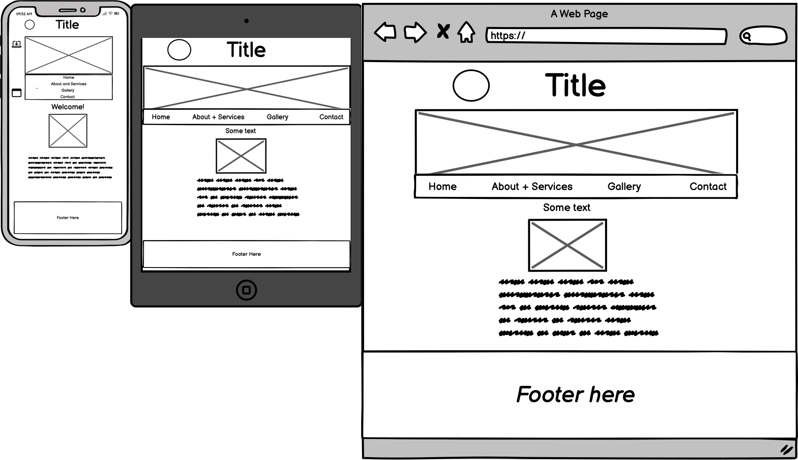
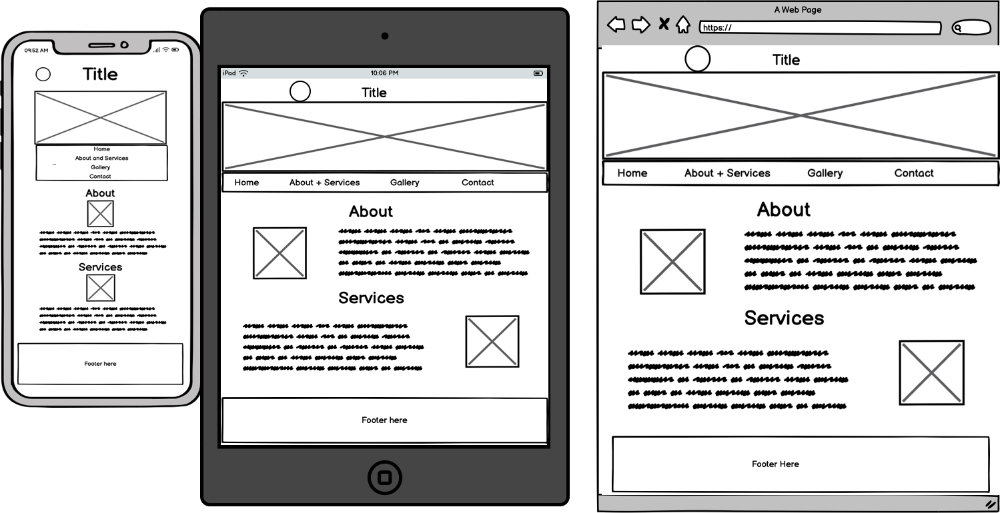
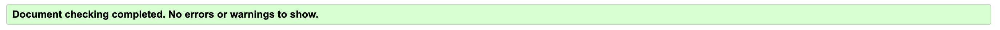

# THE MANCHESTER CATTERY

## Project Introduction

This first milestone 1 project is a website for a fake cattery business called 'The Manchester Cattery'. The website is suitable for anyone who is looking for a place for their cat/s to stay for one or more nights when their owner is away for a period of time.

# UX

## User stories

* The user should be able to find out the purpose of the website and what it is about.

* The user should be able to find out information about the cattery itself and the services that it provides.

* The user should be able to navigate between different links on the nav bar and across the website easily.

* As a user they should be able to easily find opening hours, contact and address information on the website.

* When a user clicks on the social media links, it should open up in the correct platform.

* As a user they should be able to see pictures of lots of cats on the gallery page.

* Users should be able to fill out details on the form and when clicking on the submit button to take you to 'thank you' page.

* As a user they should expect the website to be responsive and for everything to be seen clearly on different size screens such as mobile, tablet, and desktop.

* The user expects the website to run smoothly without error messages and the images to load without any issues.

## Wireframes

### Home Page 

### About and Services Page

### Gallery Page

### Contact Page

# Languages and Frameworks used

* HTML
* CSS
* Bootstrap 5

# Features

## Header

The header features a logo that I designed on canva and the title to the right of it. In small screens the logo is positioned on top of the title. There is a header image too taking up the whole width but that is only on the home page.

## Navbar 

The Navigation Bar has four links which are 'Home', 'About and Services', 'Gallery' and 'Contact' On small screens such as mobile devices the links are positioned underneath one another, and for larger screens for tablets and laptops the links are all positioned in a row spaced out. 

## Home Page

This page features a photo and some basic information and introduction about the cattery itself underneath it. The header image is only featured on this page which I mentioned above.

## About and Services Page

This is a page about the cattery itself and the services that it provides along with a couple of photos too. 

## Gallery Page

This is a page of lots of images of cats that have visited the cattery. The photos were taken from [Pexels](www.pexels.com) website. This page was created using Bootstrap flexbox.

## Contact Page

This page has a contact form where if you want to enquire about your cat/s visit or stay you can do so by filling out the form. If you click on the submit button on the form it takes you to a separate thank-you page which information when you will hear back after filling in the form. Some of the form elements have the 'required' elements meaning that you can't leave those elements blank. Also there are some basic contact details on udnerneath the form as well.

## Footer 

The footer contains information on opening times, contact details, social media links. Also a copyright link at the bottom as well. On mobile and tablet devices the information is displayed in a block, but and larger size screens such as laptops the sections are spaced out in 3 columns. 

## Thank-you Page

This isn't an official page that is on the Navigation Bar. This is the page that it takes you to when you click on the submit button on the contact form page.

# Fonts/Typography and colors

I have used a Roboto font for the title, with a back up of Helvetica, then sans-serif. The rest of the text is just as it comes.

For the colours there are four main colours across the website. For all the text I have used a black text. I have used a dark grey colour for the navigation bar. For the footer I have used a light/pale yellow colour. The background is a white background. I wanted to keep it simple to improve user experience. Any other colours used across the website are just on the photos/header image across the website.

# Testing

## HTML and CSS Validator

* For testing HTML I used the [HTML validator website]("https://validator.w3.org/") for each page.
### Home Page - index.html

### About and Services Page

### Gallery Page

### Contact Page

### Thank you Page

* For testing CSS I used the [CSS validator website]("https://jigsaw.w3.org/css-validator/").

## Manual testing

* The user should be able to find out the purpose of the website and what it is about.
    * I can confirm this information is clear on the website what it is about and its purpose.

* The user should be able to find out information about the cattery itself and the services that it provides.
    * I can confirm this information can be found on the 'About and Services Page'.

* The user should be able to navigate between different links on the nav bar and across the website easily and take you to the correct page.
    * I can confirm when clicking on all the links it takes you to the correct page and the website is easy to navigate.

* As a user they should be able to easily find opening hours, contact and address information on the website.
    * I can confirm that this information can be found on the footer on all pages of the website.

* When a user clicks on the social media links, it should open up in a new tab in the correct platform.
    * I can confirm when I click on all the social media links on the footer on all pages it opens up in a new tab in the correct platform.

* As a user they should be able to see pictures of lots of cats on the gallery page.
    * On the gallery page I can confirm there are pictures of lots of cats on the gallery page.

* Users should be able to fill out details on the form and when clicking on the submit button to take you to 'thank you' page in an new tab.
    * I can confirm details can be entered on the contact form and when submitting it takes you to a separate thank you page in a new tab.

* As a user they should expect the website to be responsive and for everything to be seen clearly on different size screens such as mobile, tablet, and desktop.
    * I have tested this in dev tools and I can confirm my website is responsive across all different devices and screen sizes.

* The user expects the website to run smoothly without error messages and the images to load without any issues.
    * I can confirm there are no error messages on the website, and the images load on all pages, even with a slight delay, on all pages of the website.

## Bugs
   
### Solved Bugs
* Centering elements and layout issues on the web pages for different screen sizes due to responsiveness 

### Unsolved
* Submit button opening up in separate thank you page even when form hasn't been filled in when clicked.
* With images being compressed before and after converting them to WebP, performance is still quite low on some pages on  some screen sizes when running Google Lighthouse. 
* Aspect ratio and low resolution issues for images when running Google Lighthouse.
* Layout shift issues when running Google Lighthouse.

# Credits

## Content

* Help with documentation for any code was from the [official Bootstrap website]("https://getbootstrap.com/docs/5.3/getting-started/introduction/") and [W3 schools]("https://www.w3schools.com/") websites. 

* Code I used/altered for the submit button was from the second snippet of code from this [Stack Overflow Page]("https://stackoverflow.com/questions/34821728/how-can-i-make-a-button-link-to-another-page"). I had to alter it based on the html validator results.

* The colour I chose for the footer was from [the rgb color code website]("https://rgbcolorcode.com/").

* The icons in the footer used were from [FontAwesome]("https://fontawesome.com/icons").

* Markdown help for the Readme was from [this github repo]("https://github.com/adam-p/markdown-here/wiki/Markdown-Cheatsheet#links").

* For removing some unused css I used the [Unused css website]("https://unused-css.com/").

## Media

* The photos of the cats across the website including the gallery page was from [Pexels]("https://www.pexels.com/").

* For converting images to webp I used a website called [Pixelied]("https://pixelied.com/convert/jpg-converter/jpg-to-webp").

* For compressing images I used the [Tinypng]("https://tinypng.com/") website.

Also thank you in general for the wonderful assistance from the slack community, tutor support and my mentor on Code Institute, and also tutorials/mentoring from the City of Bristol College.

# Deployment

## Optional:

First of all if you are wanting to use the project, you first need to fork [my repository]("https://github.com/hannahro15/Cattery-project") of the project.

Click on the green code button on the top right of the screen and copy this [link to clone]("https://github.com/hannahro15/Cattery-project.git") and then do git clone followed by that link in your terminal to add it to your computer.

## Steps to deploy the website:

Go to settings in [my repository]("https://github.com/hannahro15/Cattery-project").

Then on the side bar on the next page click on 'pages'.

After that, click on deploy from branch under the source tab.

Under the branch tab below, select main branch(could be master intead), and to the right of it select where it says /root. 

To the right of where the main/master branch were selected and '/root', then click save. 

The website should now be working and this is the [link to the deployed site]("https://hannahro15.github.io/Cattery-project/").

