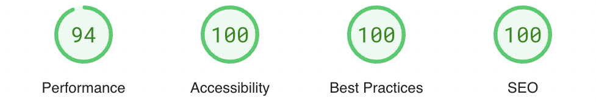
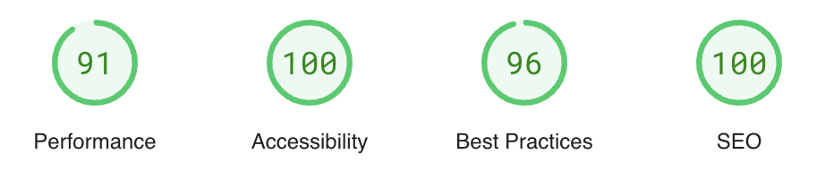
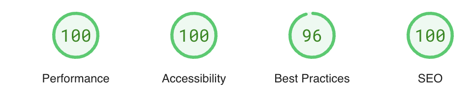
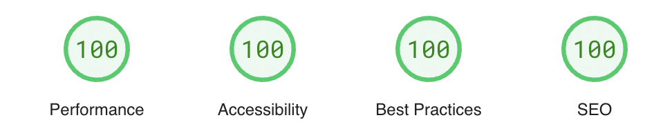

# THE MANCHESTER CATTERY

## Project Introduction

This milestone 1 project is a website I built for a fake cattery business called 'The Manchester Cattery'. The website is suitable for cat owners who are looking for a place for their cat/s to stay for one or more nights when their owner is away for a period of time. 

The website has four main pages to the website, a home page, an about and services page, a gallery page, and a contact page. There is also a separate 'thank you' page that it takes you in a new tab when clicking on the submit button after filling out the form on the contact page.

To view the project live, please click on [this link](https://hannahro15.github.io/Cattery-project/) to the project.

# UX

## User stories

* The user should be able to find out the purpose of the website and what it is about.

* The user should be able to find out information about the cattery itself and the services that it provides.

* The user should be able to navigate between different links on the nav bar and across the website easily.

* As a user they should be able to easily find opening hours, contact and address information on the website.

* When a user clicks on the social media links, it should open up in the correct platform.

* As a user they should be able to see pictures of lots of cats on the gallery page.

* Users should be able to fill out details on the form and when clicking on the submit button to take you to 'thank you' page.

* As a user they should expect the website to be responsive and for everything to be seen clearly on different size screens such as mobile, tablet, and desktop.

* The user expects the website to run smoothly without error messages and the images to load without any issues.

## Wireframes

### Home Page 

### About and Services Page

### Gallery Page

### Contact Page

# Languages and Frameworks used

* HTML
* CSS
* Bootstrap 5

# Features

Here is some information about the features and pages of the websites listed below along with the relevant screenshots.

## Header

The header features a logo that I designed on Canva along the title which appears to the right of the logo. In small screens, the logo is positioned on top of the title. There is a header image below that taking up the whole width but the header image is only featured on the home page. 

## Navbar 

The navigation bar has four links to each of the pages which are 'Home', 'About and Services', 'Gallery' and 'Contact' On small screens such as mobile devices the links are positioned underneath one another, and for larger screens for tablets and laptops the links are all positioned in a row spaced out. 

### Mobile view

### Desktop view

## Home Page

This page features a photo and some basic information and introduction about the cattery itself underneath it. The header image is only featured on this page which I mentioned above.

## About and Services Page

This is a page about the cattery itself and the services that it provides along with a couple of photos too. 

## Gallery Page

This is a page of lots of images of cats that have visited the cattery. The photos were taken from [Pexels](www.pexels.com) website. This page was created using Bootstrap flexbox.

## Contact Page

This page has a contact form where if you want to enquire about your cat/s visit or stay you can do so by filling out the form. If you click on the submit button on the form it takes you to a separate 'thank you' page which gives you information on when you will hear back after filling in the form. Some of the form elements have the 'required' elements meaning that you can't leave those elements blank. Also there are some basic contact details on udnerneath the form as well.

## Footer 

The footer contains information on opening times, contact details, social media links. Also a copyright link at the bottom as well. On mobile and tablet devices the information is displayed in a block, but on larger size screens such as laptops the sections are spaced out in three columns. 

## Thank you Page

This isn't an official page that is on the Navigation Bar. This is the page that it takes you to when you click on the submit button on the contact form page. It features the logo and title of the Cattery with a short paragraph underneath of about the form response time.

## Possible Future Features

Here is a list of possible features below that could be added in the future to improve the website.

* Add a hamburger menu to the Navbar.
* Add map to the website.
* Add audio/video clips.
* Expand on the contact form and content throughout the website.
* Add more interactivity/Javascript to the website.

# Fonts/Typography and colors

## Fonts 

* I have used a Roboto font for the title, with a back up of Helvetica, then sans-serif. 

* For all text other than the title the font I have used is Verdana. 

* I have capitalised all titles and headings to make it stand out.

## Colours

* For the colours there are four main colours across the website. 

* For all the text I have used a black text. 

* I have used a dark grey colour for the navigation bar with a light grey colour for the box-shadow. 

* For the form container I have used a green background with a double-lined black border around the edge, with a light grey colour for the box-shadow. 

* For the footer I have used a light/pale yellow colour called a Golden Rod Eye yellow. 

* For the background I wanted it to be a plain and white to make the elements on the website visible and clear. I also wanted to keep it simple to improve user experience.  

* Any other colours used are across the website are on the photos across the website and on the header image.

# Testing

## HTML and CSS Validator

Throughout working on the project I used the HTML and CSS validators to check there were no errors in my code. Here are the screenshots once everything had been validated.

* For testing HTML I used the [HTML validator website](https://validator.w3.org/) for each page.
### Home Page - index.html

### About and Services Page

### Gallery Page

### Contact Page

### Thank you Page

* For testing CSS I used the [CSS validator website](https://jigsaw.w3.org/css-validator/).

## Manual testing

I have manually tested my website on my mobile and desktop using the user stories mentioned above and I can confirm the following below:

* I can easily find out the purpose of the website and what it is about.

* I can find out the information about the cattery itself and the services which can be found on the 'About and Services Page'.

* When clicking on the navigation bar all the links takes me to the correct page and also the website is easy to navigate.

* I can easily find the opening hours, contact and address information on the website which can be found on the footer on all pages and all screen sizes. Also some of the contact details are found on the contact page underneath the form.

* When I click on all the social media links in the footer on all pages they open up in a new tab in the correct platform.

* The gallery page has lots of pictures of cats.

* I can confirm that once details have been entered on the contact form and when submitting it that it takes you to a separate thank you page in a new tab. This is has been checked using form validation.

* I have tested responsiveness in dev tools and I can confirm my website is responsive across all different devices and screen sizes, and everything can be seen clearly.

* I can confirm there are no error messages on the website, and that the images load ok.

## Lighthouse Testing

I have been testing through Lighthouse using the Page Speed insights website throught the project. Here is the [link](https://pagespeed.web.dev/) of the website. These are screenshots of the final Lighthouse scores below for both mobile and desktop on each page for 'Performance', 'Accessibility', 'Best Practices' and 'SEO' although they can vary slightly. Please see in the 'Bugs' in the section below this for issues that I had when running lighthouse along with other issues.

### Home Page

#### Mobile

#### Desktop

### About and Services Page

#### Mobile

#### Desktop

### Gallery Page

#### Mobile

#### Desktop

### Contact Page

#### Mobile

#### Desktop

### Thank you Page

#### Mobile

#### Desktop

## Bugs
   
### Solved Bugs
* Centering elements, especially the logo, and other layout issues on the web pages for different screen sizes due to responsiveness. 
* Dev tools showing more white space on the bottom of some pages when I clicked on the various breakpoints compared to when I checked on my own desktop, mobile and on the 'Am I responsive website'. 
* Submit button opening up in separate thank you page even when form hasn't been filled in when clicked. Solved this by changing the anchor tag to an input tag and and having a type button called 'submit'.

### Unsolved Bugs
* With images being compressed before and after converting them to WebP, performance is still quite low on some pages on some screen sizes when running Google Lighthouse, especially on home page and gallery.
* Logo which I created in Canva has a low resolution issue on small screens according to Google Lighthouse but it is fine on desktop, even after converting to webp and compressing, and also re-running Lighthouse on the Page Speed Insights  website again afterwards. The logo doesn't at all look pixelated or fuzzy though, and it looks very clear on all screen sizes on my desktop and mobile.

# Credits

## Content

*  For creating the logo I used [Canva](https://www.canva.com/).

* For validating HTML and CSS throughout the project I used [the HTML validator website](https://validator.w3.org/) and [the CSS validator website](https://jigsaw.w3.org/css-validator/).

* Help with documentation for the basic structure of code was from the [official Bootstrap website]("https://getbootstrap.com/docs/5.3/getting-started/introduction/") and [W3 schools](https://www.w3schools.com/) websites. 

* The colour I chose for the footer was from [the rgb color code website](https://rgbcolorcode.com/).

* The icons in the footer used were from [FontAwesome](https://fontawesome.com/icons).

* Markdown help for the Readme was from [this github repo](https://github.com/adam-p/markdown-here/wiki/Markdown-Cheatsheet#links).

* For help with putting in the box shadow around the navigation bar and the contact form I used most of the top line of the code in the demo box from the information on box shadows on [mdn docs](https://developer.mozilla.org/en-US/docs/Web/CSS/box-shadow). I changed the colour and the type of border. 

* For help with removing some unused css I used the [unused css website](https://unused-css.com/) and also dev tools on Google chrome.

* For help converting some css to Bootstrap I used the Bootstrap translator on [Rellaco](https://rellaco.com/bootstrap-translator/).

* For pushing the footer to the bottom after removing the position fixed I used some of this code on [this](https://www.30secondsofcode.org/css/s/footer-at-the-bottom/) webpage. The 30 seconds of code website about the footer being on the bottom.

* For testing performance, accessibility, best practices and SEO on all pages I used a website called Page Speed Insights [link](https://pagespeed.web.dev/) which is very similar to Google Lighthouse on dev tools but more reliable.

* For testing responsiveness I used a website called ['Am I responsive'](https://ui.dev/amiresponsive) and also for taking screenshots of the different pages on the website.

## Media

* The photos of the cats across the website including the gallery page was from [Pexels](https://www.pexels.com/).

* For converting images to webp I used a website called [Pixelied](https://pixelied.com/convert/jpg-converter/jpg-to-webp).

* For compressing images I used the [Tinypng](https://tinypng.com/) website.

Also thank you in general for the wonderful assistance from the slack community, tutor support and my mentor on Code Institute, and also tutorials/mentoring from the City of Bristol College.

# Deployment

## Steps for local deployment

Fork the [repository](https://github.com/hannahro15/Cattery-project).

Click on the green code button .

Copy the url link.

Type git clone followed by that url [link ](https://github.com/hannahro15/Cattery-project.git) in your terminal to add/clone it to your computer.

## Steps to deploy the website to GitHub Pages

Go to settings in your [repository](https://github.com/hannahro15/Cattery-project).

Then on the side bar on the next page click on 'pages'.

After that, click on deploy from branch under the source tab.

Under the branch tab below, select main branch(could be master instead), and to the right of it select where it says /root. 

To the right of where the main/master branch were selected and '/root', then click save. 

The website should now be working and this is the [link to the deployed site](https://hannahro15.github.io/Cattery-project/) which is found in your repository.

